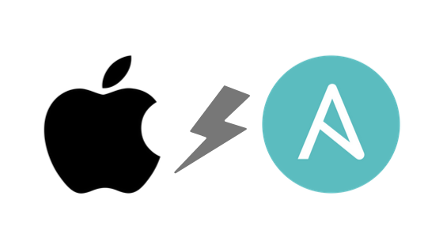

<p align="center">
  
</p>

<h2 align="center">Mac Via Ansible</h2>

<p align="center">Macbook setup and configuration via Ansible.</p>

<br>

### Run

```zsh
% ansible-playbook -vv provisioning.yml
```
